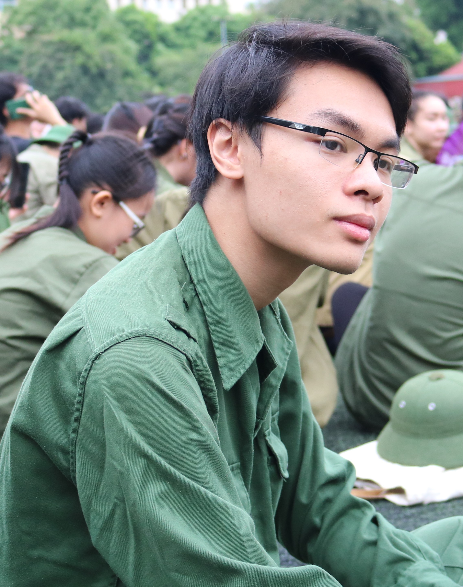

# About Me

## My Background

{ align="left", width="25%", height="25%"}

My name is **Casper Nguyen**, but that is actually my preferred name. My real name is **Hoang Trung Nguyen**, originally coming from Hanoi, Vietnam. My birth name originates from [Huang Zhong](https://en.wikipedia.org/wiki/Huang_Zhong), one of the Five Tiger Generals featured in the tales of [Three Kingdoms](https://en.wikipedia.org/wiki/Three_Kingdoms). My dad and my older brother were really into that piece of literature at the time. My preferred name (Casper) comes from my Instagram story asking my friends for an English name that I can use in Canada (thank you Phuong Ha - she probably can't remember who I am at this point).

I was born on September 25, 2002, into a family of four. My dad was a military officer, (retired as we speak) with the rank of colonel. He went to the [Military Technology Academy (MTA)](https://en.wikipedia.org/wiki/Le_Quy_Don_Technical_University) in Hanoi and held two degrees, one in computer engineering and one in missile engineering (what a chad). He started out working on Soviet-supplied air defense systems (which is why he used to speak Russian), then switched to military intelligence sometime later and spent the majority of his career there. He was the main reason that I have a passion for military stuff. My mom went to the Academy of Finance and works for the General Department of Taxation - Ministry of Finance (she is gonna retire soon). She had about a year of specialized education in France in the 2000s, and she also spoke French. My brother is 7 years older than me, and went to the [Foreign Language Specialized School (CNN)](https://en.wikipedia.org/wiki/Foreign_Language_Specialized_School), where he studied Russian, and then to [Foreign Trade University (FTU)](https://en.wikipedia.org/wiki/Foreign_Trade_University) for Bachelor of Internation Business Economics. He now works in advertisement. I am not really sure what exactly that he does, but he is well and good. He works in Ho Chi Minh City.

And lastly, there is me! I, like my brother, also got into a highly selective high school in Hanoi - [High School for Gifted Students, HNUE (CSP)](https://en.wikipedia.org/wiki/High_School_for_Gifted_Students,_Hanoi_National_University_of_Education) - where I specialized in English. I think in my year the admission rate into English is about 1 in 27, and I was kind of at the bottom of the list. After 3 wonderful years of high school, I enrolled in the [University of Alberta](https://en.wikipedia.org/wiki/University_of_Alberta) for Computing Science, and currently living in Canada.

## My Hobbies

### Anime and Manga

{ align="right", width="15%", height="15%"}

This is probably what I spent most of my time on when I was in high school. I stll love it, but I have less time now. I am more of an anime person, although I do read manga as well. I do read a bit of light novel, but never actually finished any. My favourite genre is magic/supernatural with OP main character. It sounds boring to many, but for long I had been watching anime to escape reality. 

Anyways I watch whatever makes me relaxed and happy. Sounds good? You can check my [My Anime List (MAL)](https://myanimelist.net/profile/SCWinter?q=SCwinter&cat=user) profile to see what I watch.

### Korean and Chinese Dramas

{ align="left", width="12%", height="12%"}

This is something that I picked up a bit later than Anime, but also spent a goog amount of time watching in high school. My main category was romance. I only watch finished dramas with happy ending and nice rating. Same reason as in the Anime section. I favour the appearance of actress/actor over acting though.

Discover what I watch on my [My Drama List](https://mydramalist.com/profile/SCWinter) account.

### Music

I listen to a variety of music genres (and languages). I most listen to V-pop, K-pop, and US-UK. However, you can also find many Japanese, Chinese, French, Russian, and even German songs in my 1400+ songs Spotify playlist.

My music also range across indie, pop, pop rock, rock, folk, instrumental, classical, revolutionary, ... You can find BlackPink next to Michael Buble, or Russian Revolutionary music next to anime openings.

I can give you some of my favourite artists:

- Vietnamese: Son Tung M-TP, Ngot, Vu., Wren Evans, Low G, Space Speakers, Hoang Dung
- US-UK: Ed Sheeran, Taylor Swift, Bruno Mars, Bruno Major, Laufey
- Korean: Big Bang, (G)I-DLE, New Jeans
- Russian: The Red Army Choir (that's where a lot of the revolutionary music comes from)