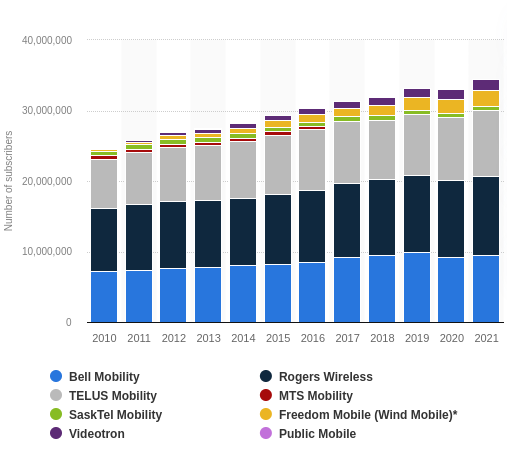

# LIFE_2: The terrible customer winbacks

*Created: May 14, 2024*

*Note that $ in this article is Canadina Dollar (CAD)*

Recently, I switched my phone plan provider from Fido to Freedom. Since most phone plans in Canada are unlimited calling and texting within Canada and the US, the decision basically comes down to how much do you pay for what amount of mobile data.

When I first came to Canada, I was unable to take on Freedom's mobile plan because my phone back then (Oppo A3s) did not accept the Freedom SIM card for some reason. The best option I could get was $50 (pre-tax) for 10 GB of data per month. Compared to Vietnam, where I came from, it was incredibly expensive. I stayed with it for about 3 years, and even bought a new phone with Fido (Samsung A53).

About a 2 months ago, I realised that most providers, including Fido, were having the same offer - $34 for 40 GB. I asked Fido representatives twice, in person, to see if they have the same offer, or even anything better for me. After all, I have been their customer for 3 years, right?

Wrong! The best they had for me was $50 for 40 GB. They said the $34 offer is only for new customers. Outrageous. You all know what happened next - I switched to Freedom.

The bad experience did not stop there. It has been more than a month since the switch, and I had received multiple calls from Fido Customer Winback team. They called me up to the point FIDO ROGERS was recognised by my phone as a scammer. They tried to offer me so-called "demo" packages, something like $20 for 50 GB, just for me, lifetime (of course I can switch when I want to also). I just kinda told them to stop calling me, it's like begging your ex to come back.

Seriously, I think it is common sense that long time and existing customers should get the same or better offers than new comers. A reward for loyalty. Giving new comers better options than existing customers should normally have an adverse effect, as people know they are gonna be worse off later on. 

<figure markdown="span">
  
  <figcaption>Number of mobile subscribers in Canada by service provider from 2010 to 2021</figcaption>
</figure>

However, providers in Canada are getting away with this kind of business conduct because of the lack of competition. Rogers, Bell, Telus, and Freedom, together control **90% of the market**. I switched my provider, but I know that I will have to switch again in a year, just because all of them do not provide additional benefits to existing customers. In the end, we are just circling providers, and all of them ended up having stable customer bases despite a being bad business model. It also explains why Canada has such a high internet/phone cost compared to many other countries. The same would happen in aviation and banking.

This made me realised that **authoritarianism**, although usually referred to as a political concept, actually rooted in the lack of competition. We just have a different word for it in economics: **Oligarchy**.