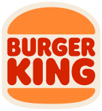
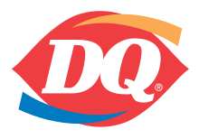

# Reviewing all fastfood chains in Canada

My mom used to praised fastfood chains in the US, especially McDonald's, so much that their Vietnamese branches look like mere low-level clones. Now, I have not been to the US, but since I lowkey consider Canada the 51st state, I still made it the first doom quest to try out all fastfood chains in Canada.

<!-- more -->

## A&W

The first thing I noticed when I came to A&W is an incredibly short menu, and this seems to be consistent at every location that I have been to. It mostly offers 3 things: burgers, fries, and drinks. 

I usually order 2 **buddy burgers** for a random lunch, because they are incredibly cheap for quite a full meal. The buddy burger is just simply a beef burger piece and 2 buns - that bare bone and nothing more. However 2 of them for like $6-7 can be considered a good deal. If you are thinking about spending more than $10 for their bigger burgers, I think you are better off spending $15-17 at a local restaurant for a bigger, better burger, and a fries portion.

The most notable thing about this burger chain is, ironically, its drink - the **root beer** in particular. The A&W root beer is so good that it dominates the root beer market *outside* of the restaurant, and I think you might want to check it out.

## Booster Juice

Booster Juice was the first chain in this list that I had the chance to try in Canada. Ironically, I did not know it was a fastfood chain (it should have seemed obvious enough though), and did not intend to try it out. August 19, 2021, I landed at Vancouver Airport, and really needed something to drink through lunch. I wanted to choose something interesting because I had 6 hours of transit and do nothing.

I did not remember what I ordered, but it was bad. Maybe it was just my taste. It was too much sour, a fruit drink that felt like raw fruit juice. Maybe many people like it, I don't know. In Vietnam, we have far better options at much cheaper prices. They may have a bit of sugar, but somehow still feel more natural than Booster Juice. I never went to Booster Juice again, at least up until I write this line, which is more than 3 years later.

## Burger King

Burger King is a chain that left me a good impression many years ago, when I try out one of its location in Hanoi, Vietnam, and I was quite surprised when I hear that it is a fading chain in North America. There was probably only one location in Edmonton, and it was quite far away from where I stayed, so I never visited. It is only until recently (May 2024) that I tried it again, in Waterloo, via a Doordash order.

I ordered their signature **Whopper Burger**, and although it was a bit more expensive than the big burgers from other chains, the quality was worth it. The Whopper was huge, with 2 huge meat patties that was grilled perfectly. I could tell that the meat and the grilling were all of high quality (as compared to a fastfood chain). The difference in quality just catched my eyes even before I eat. Highly recommend this item.

## Diary Queen

I didn't really know what to expect from Dairy Queen, as there is nothing similar in Vietnam. The only I knew about the chain was that it sells ice cream or milkshake or something like that.

However! The first thing i tried was home-delivered chicken tenders. They were kinda bad - dry and over-seasoned. From the second time on, I only bought ice cream (**blizzard**, specifically). They were good. My girlfriend is an ice cream enthusiast, and she said DQ ice cream is not that good, but come on it's a fastfood chain. I say they are good enough, especially for the price.

## Denny's

## Domino's Pizza

## Harvey's

## Jollibee

## KFC

## McDonald's

## New York Fries

## Panda Express

## Pizza Hut

## Pizza 73

## Popeyes Louisiana Kitchen

## Subway

## Starbucks Coffee

## Taco Bell

## Thai Express

## Tim Hortons

## Wendy's