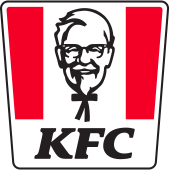

# Reviewing all fastfood chains in Canada

My mom used to praised fastfood chains in the US, especially McDonald's, so much that their Vietnamese branches look like mere low-level clones. Now, I have not been to the US, but since I lowkey consider Canada the 51st state, I still made it the first doom quest to try out all fastfood chains in Canada.

<!-- more -->

## A&W

The first thing I noticed when I came to A&W is an incredibly short menu, and this seems to be consistent at every location that I have been to. It mostly offers 3 things: burgers, fries, and drinks. 

I usually order 2 **buddy burgers** for a random lunch, because they are incredibly cheap for quite a full meal. The buddy burger is just simply a beef burger piece and 2 buns - that bare bone and nothing more. However 2 of them for like $6-7 can be considered a good deal. If you are thinking about spending more than $10 for their bigger burgers, I think you are better off spending $15-17 at a local restaurant for a bigger, better burger, and a fries portion.

The most notable thing about this burger chain is, ironically, its drink - the **root beer** in particular. The A&W root beer is so good that it dominates the root beer market *outside* of the restaurant, and I think you might want to check it out.

## Arby's

## Applebee's

## Auntie Ann's

## La Belle Province

## Booster Juice

Booster Juice was the first chain in this list that I had the chance to try in Canada. Ironically, I did not know it was a fastfood chain (it should have seemed obvious enough though), and did not intend to try it out. August 19, 2021, I landed at Vancouver Airport, and really needed something to drink through lunch. I wanted to choose something interesting because I had 6 hours of transit and do nothing.

I did not remember what I ordered, but it was bad. Maybe it was just my taste. It was too much sour, a fruit drink that felt like raw fruit juice. Maybe many people like it, I don't know. In Vietnam, we have far better options at much cheaper prices. They may have a bit of sugar, but somehow still feel more natural than Booster Juice. I never went to Booster Juice again, at least up until I write this line, which is more than 3 years later.

## Burger Baron

## barBURRITO

## Boston Pizza

## Burger King

Burger King is a chain that left me a good impression many years ago, when I try out one of its location in Hanoi, Vietnam, and I was quite surprised when I hear that it is a fading chain in North America. There was probably only one location in Edmonton, and it was quite far away from where I stayed, so I never visited. It is only until recently (May 2024) that I tried it again, in Waterloo, via a Doordash order.

I ordered their signature **Whopper Burger**, and although it was a bit more expensive than the big burgers from other chains, the quality was worth it. The Whopper was huge, with 2 huge meat patties that was grilled perfectly. I could tell that the meat and the grilling were all of high quality (as compared to a fastfood chain). The difference in quality just catched my eyes even before I eat. Highly recommend this item.

## Baskin-Robbins

## Carl's Jr.

## Chez Aston

## Chicken Delight

## Chipotle Mexican Grill

## Chick-fil-A

## Cora

## Cinnabon

## Coffee Time

## Country Style

## Diary Queen

I didn't really know what to expect from Dairy Queen, as there is nothing similar in Vietnam. The only I knew about the chain was that it sells ice cream or milkshake or something like that.

However! The first thing i tried was home-delivered chicken tenders. They were kinda bad - dry and over-seasoned. From the second time on, I only bought ice cream (**blizzard**, specifically). They were good. My girlfriend is an ice cream enthusiast, and she said DQ ice cream is not that good, but come on it's a fastfood chain. I say they are good enough, especially for the price.

## Denny's

I had dinner at Denny's once. It actually gave me a more of a cinematic-like American diner feel than a fastfood restaurant. Even the menu items. Like sure, it had burgers and chicken, but it also had sandwiches and other breakfast-type items. Maybe it's a diner chain?

Anyways, the food was okay. I cannot remember what I ordered, but surely I felt nothing was really worth the price. It was with the price of a meal at a diner, but at fastfood quality. Honestly not recommended if you value your money.

## Dixie Lee Fried Chicken

## Domino's Pizza

The pinnacle of cheap pizza. I have had it so many times. If, for any event, people decided that pizza will be served for free (usually the event involves students), then you bet 80% of the time it is gonna be Domino's. The quality is kinda crappy, but unless it is a pizza 3 times more expensive than theirs, you may not be able to tell the difference, as an average person.

Menu is diverse, price is cheap, quality is okay enough. That is all I have to say. King of the cheap pizza segment.

## Edo Japan

## Extreme Pita

## East Side Mario's

## Five Guys

## Fryer's

## Freshii

## Firehouse Subs

## Fat Burger

## Greco Pizza

## Godfather's Pizza

## Harvey's

I ate at Harvey's once or twice before, and I must say that except for the fact that it's a Canadian chain, nothing felt special. Not even one item, and not the pricing of eny item either. Like heck, even A&W has the famous root beer that got the whole country of Canada go crazy. If it is not for the lack of competition in the Canadian market, I think Harvey's wouldn't have been that big of a chain. It is a place that, if you are near by, and hungry, and you are like "meh, whatever", then you come in. Not bad, not good, nothing special.

## Hero Certified Burgers

## IHOP

## Jimmy the Greek

## Jimmy John's Subs

## Jollibee

Jollibee, in my opinion, should be the standard of fastfood in Canada. It is the first big chain that I feel like the chain as a whole is worth your meal. I'm not even saying that the chain gives an incredible money value for your food or anything, but this is the standard. The main product is fried chicken, and although it has enough spices, enough crispiness, and the portion is big enough for the price. Wanna buy a chicken bucket? Buy at Jollibee. I don't care about the dip because I never dip my chicken, so no comments on that.

I heard that there are also other products like spaghetti, but I never checked for that. If the menu is diversed, it would also be a huge plus.

## KFC

KFC was my favourite in Vietnam, so subsequenty it was the most awaited experience for me when I came to Canada. I swear it felt very disappointing. 

I think I ordered it the first time in a mall in Edmonton, and the chicken drumstick was not only wimpy, but it was also of realy dark and dirty color, like it had been fried in crude oil or something. There was very little meat. The breading was wimpy but the chicken was dry. I don't know how they can do that.

The next time was an Uber order in Vancouver. It looked cleaner, less dry, but still with the wimpy breading. It did not save my impression for the brand, but my mom liked it somehow.

The last time was in Toronto, at a food court. This time was the most impressive. Breading was crispy, the chicken was moist, seasoning was enough. It still doesn't look appetizing though, definitely of darker color than most other franchises.

Overall, I think KFC in North America is not good. The menu is very limited and nothing was really new. The pricing is fine, but I'm not quite sure if it is a good value for the food. I mean, the food quality, at best, is a hit or miss, and even that is also a sign of the crappy quality control across KFC branches. After some digging, it seems like KFC in NA has been in this spiral downwards for a decade or two. On the other hand KFC in other places (like Japan) is very popular for their quality and creative menu, so my advice is try KFC, but not in NA.

## Krispy Kreme Donuts

## Kelsey Original Roadhouse

## Lafleur Restaurants

## Little Ceasars

## Manchu Wok

## Mary Brown's Chicken

## McDonald's

## Mrs. Fields

## Marble Slab Creamery

## Mr.Sub

## Mucho Burrito

## Montana's BBQ & Bar

## Milestones Grill & Bar

## New York Fries

## Orange Julius

## Panda Express

## Papa John's

## Pita Pit

## Pizza Pizza

## Pizza Hut

## Pizza Nova

## Panera Bread

## Pizza 73

## Popeyes Louisiana Kitchen

## Quiznos Subs

## Qdoba

## Robin's Donuts

## Second Cup

## Smitty's

## St-Hubert

## Shoeless Joe's

## Subway

## Swiss Chalet

## St Louis

## Shake Shack

## Starbucks Coffee

## Taco Bell

## Taco del Mar

## Taco Time

## Thai Express

## Tim Hortons

## The Keg

## Valentine

## Wendy's

## White Spot

## Wild Wing

## Wimpy's Diner

## Yogen Fruz